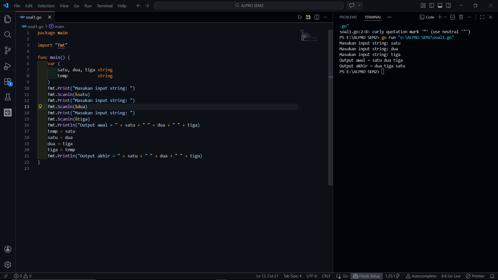

# <h1 align="center">Laporan Praktikum Modul 1 - ... </h1>
<p align="center">[Akhmad Noval Annur] - [109082500100]</p>

## Unguided 

### 1. [Soal]
#### soal1.go

```go
package main

import "fmt"

func main() {
	var (
		satu, dua, tiga string
		temp            string
	)
	fmt.Print("Masukan input string: ")
	fmt.Scanln(&satu)
	fmt.Print("Masukan input string: ")
	fmt.Scanln(&dua)
	fmt.Print("Masukan input string: ")
	fmt.Scanln(&tiga)
	fmt.Println("Output awal = " + satu + " " + dua + " " + tiga)
	temp = satu
	satu = dua
	dua = tiga
	tiga = temp
	fmt.Println("Output akhir = " + satu + " " + dua + " " + tiga)
}

```
### Output Unguided :

##### Output 

[penjelasan]
Program pada soal ini berfungsi untuk menerima tiga buah input berupa string dari pengguna. Pengguna diminta memasukkan tiga kata atau teks yang akan disimpan dalam tiga variabel berbeda. Setelah semua data dimasukkan, program akan menampilkan urutan awal dari ketiga string tersebut sesuai dengan input yang diberikan oleh pengguna.

Setelah menampilkan urutan awal, program kemudian melakukan pertukaran posisi nilai pada variabel menggunakan variabel sementara bernama temp. Nilai dari variabel pertama disimpan sementara, lalu variabel pertama diisi dengan nilai variabel kedua, variabel kedua diisi dengan nilai variabel ketiga, dan variabel ketiga diisi dengan nilai yang sebelumnya disimpan pada temp. Setelah proses ini selesai, program menampilkan output akhir yang menunjukkan bahwa posisi ketiga string telah berubah
