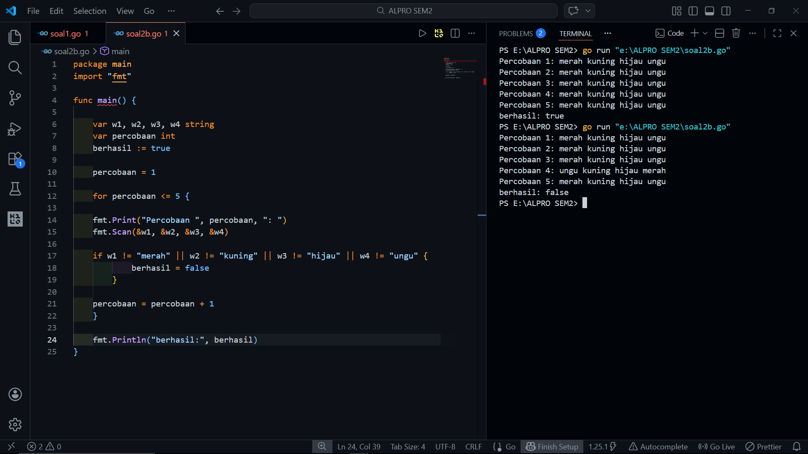

# <h1 align="center">Laporan Praktikum Modul 1 - ... </h1>
<p align="center">[Akhmad Noval Annur] - [109082500100]</p>

## Unguided 

### 1. [Soal]
#### soal1.go

```go
package main

package main
import "fmt"

func main() {

    var w1, w2, w3, w4 string
    var percobaan int
    berhasil := true

    percobaan = 1

    for percobaan <= 5 {

    fmt.Print("Percobaan ", percobaan, ": ")
    fmt.Scan(&w1, &w2, &w3, &w4)

    if w1 != "merah" || w2 != "kuning" || w3 != "hijau" || w4 != "ungu" {
            berhasil = false
        }

    percobaan = percobaan + 1
    }

    fmt.Println("berhasil:", berhasil)
}


```
### Output Unguided :

##### Output 

[penjelasan]
Program ini dibuat untuk mencatat hasil percobaan praktikum kimia yang dilakukan sebanyak lima kali percobaan. Pada setiap percobaan terdapat empat tabung reaksi yang masing-masing berisi cairan dengan warna tertentu. Pengguna diminta memasukkan warna dari keempat tabung tersebut setiap kali percobaan dilakukan. Program kemudian memeriksa apakah urutan warna yang dimasukkan sesuai dengan ketentuan yang diberikan.

Urutan warna yang dianggap benar adalah merah, kuning, hijau, dan ungu secara berurutan. Jika semua percobaan yang dilakukan sebanyak lima kali memiliki urutan warna yang sesuai, maka program akan menampilkan hasil true yang berarti percobaan berhasil. Namun jika terdapat satu saja percobaan yang tidak sesuai dengan urutan warna tersebut, maka program akan menampilkan hasil false yang menandakan bahwa percobaan tidak berhasil.
