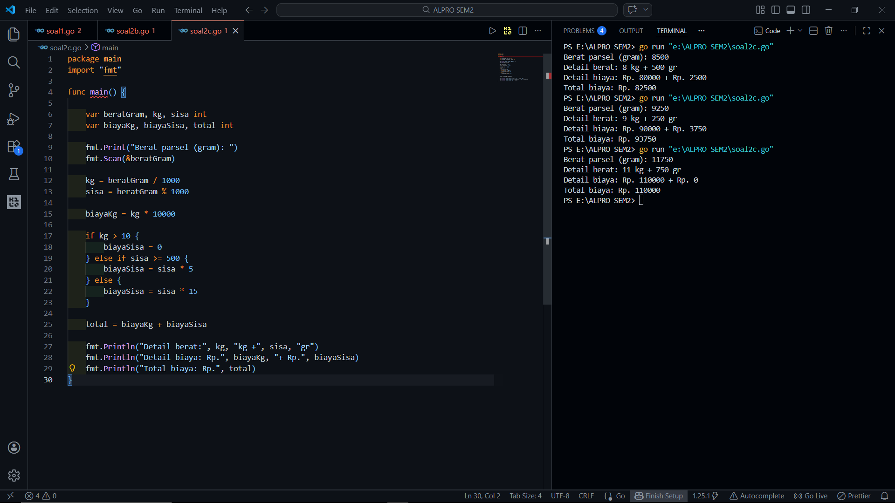

# <h1 align="center">Laporan Praktikum Modul 1 - ... </h1>
<p align="center">[Akhmad Noval Annur] - [109082500100]</p>

## Unguided 

### 1. [Soal]
#### soal1.go

```go
package main

import "fmt"

func main() {
	var (
		satu, dua, tiga string
		temp            string
	)
	fmt.Print("Masukan input string: ")
	fmt.Scanln(&satu)
	fmt.Print("Masukan input string: ")
	fmt.Scanln(&dua)
	fmt.Print("Masukan input string: ")
	fmt.Scanln(&tiga)
	fmt.Println("Output awal = " + satu + " " + dua + " " + tiga)
	temp = satu
	satu = dua
	dua = tiga
	tiga = temp
	fmt.Println("Output akhir = " + satu + " " + dua + " " + tiga)
}

```
### Output Unguided :

##### Output 

[penjelasan]
Program ini dibuat untuk menghitung biaya pengiriman parsel di PT POS berdasarkan berat barang dalam gram. Pengguna terlebih dahulu diminta memasukkan berat parsel dalam satuan gram. Program kemudian mengubah berat tersebut menjadi kilogram dan sisa gram dengan cara membagi berat gram dengan 1000. Hasil pembagian menunjukkan jumlah kilogram, sedangkan sisa pembagian menunjukkan jumlah gram yang tersisa.

Biaya pengiriman utama dihitung sebesar Rp10.000 untuk setiap kilogram. Selain itu terdapat biaya tambahan untuk sisa berat yang kurang dari satu kilogram. Jika sisa berat 500 gram atau lebih, maka dikenakan biaya tambahan Rp5 per gram, sedangkan jika sisa berat kurang dari 500 gram maka dikenakan biaya Rp15 per gram. Namun apabila total berat parsel lebih dari 10 kilogram, maka biaya tambahan dari sisa gram tersebut digratiskan. Setelah semua perhitungan selesai, program akan menampilkan detail berat, rincian biaya, serta total biaya pengiriman yang harus dibayar.